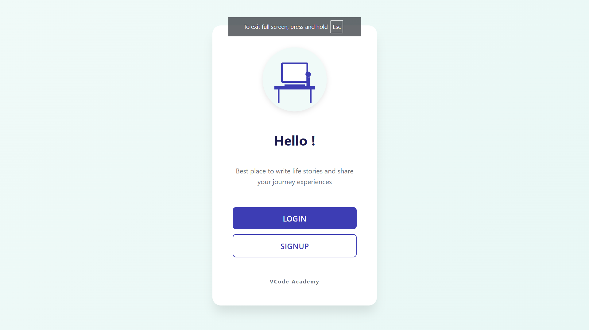
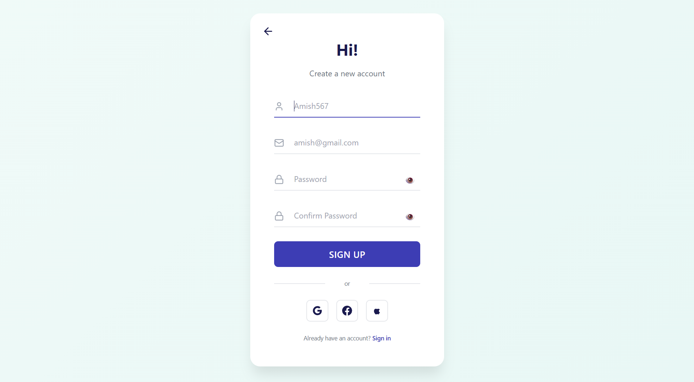
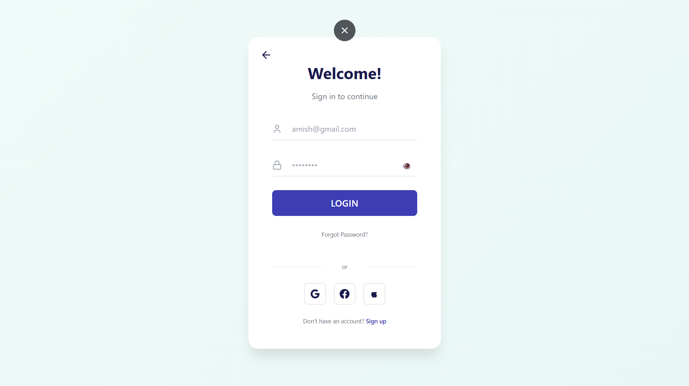
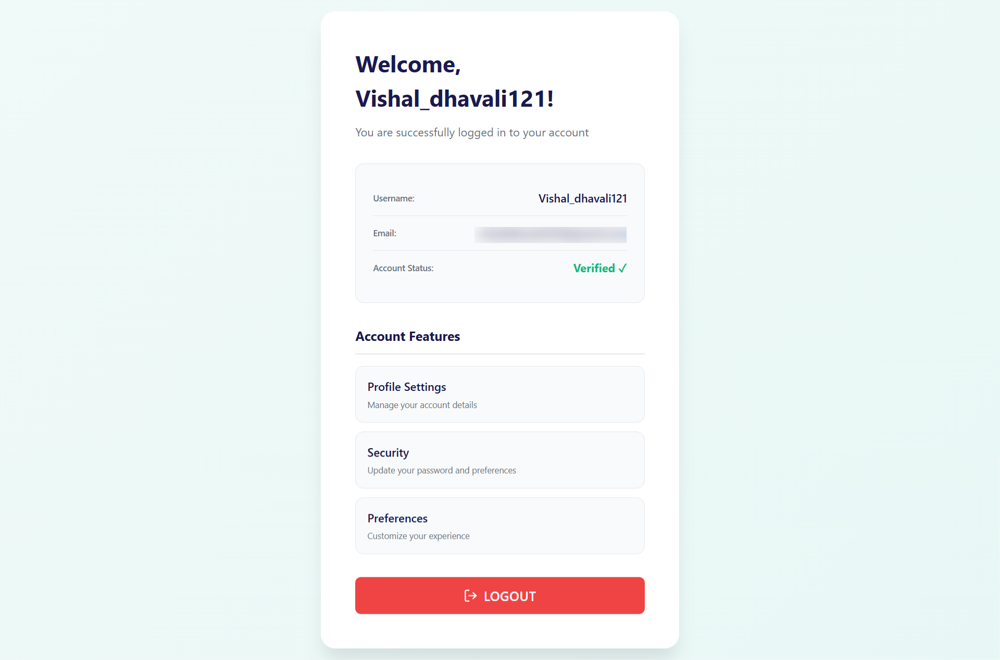

# VCode Academy - Full Stack Authentication System

A complete, production-ready authentication system with JWT tokens and OTP email verification. Built with **Spring Boot 4.0.4** backend and **React 18** frontend.

> **Status:** ✅ Complete | **Version:** 1.0.0 | **License:** VCode Academy © 2026

---

## Table of Contents

- [Overview](#overview)
- [Features](#features)
- [Project Structure](#project-structure)
- [Database Design](#database-design)
- [Screenshots](#screenshots)
- [Backend Setup](#backend-setup)
- [Frontend Setup](#frontend-setup)
- [API Endpoints](#api-endpoints)
- [Tech Stack](#tech-stack)
- [Security](#security)
- [Troubleshooting](#troubleshooting)

---

## Overview

This is a complete authentication system that demonstrates:
- User registration with email validation
- Secure login with BCrypt hashing
- OTP-based email verification (6 digits, 5-minute expiry)
- JWT token authentication with HttpOnly cookies
- Protected routes and user dashboard
- Responsive design for mobile and desktop
- Production-ready code structure

---

## Features

✅ **User Registration**
- Email validation
- Password strength requirements
- Duplicate email prevention

✅ **Email-based OTP Verification**
- 6-digit OTP codes
- 5-minute expiration timer
- Auto-resend functionality
- Gmail SMTP integration

✅ **Secure Login**
- BCrypt password hashing
- JWT token generation
- HttpOnly cookie storage (XSS protection)
- Auto-logout on token expiry

✅ **Protected Dashboard**
- User profile information display
- Email verification status
- Logout functionality
- Route guards for unauthorized access

✅ **Responsive UI**
- Mobile-first design
- CSS Modules styling
- Zero external CSS frameworks
- Smooth animations and transitions

✅ **Security Features**
- CORS configured for development
- SameSite and Secure cookie flags
- Stateless JWT authentication
- Password hashing with BCrypt
- Protected API endpoints

---

## Project Structure

```
Java_Authication_system/
│
├── Backend-java/                          # Spring Boot Application
│   ├── src/main/java/com/vd/reactapp/
│   │   ├── Config/
│   │   │   ├── JwtFilter.java            # JWT validation filter
│   │   │   └── SecurityConfig.java       # Spring Security setup
│   │   ├── Controller/
│   │   │   ├── RegisterController.java   # User registration
│   │   │   ├── login_controller.java     # Login & JWT issuing
│   │   │   ├── Otp_verification.java     # OTP verification
│   │   │   └── UserController.java       # User data endpoint
│   │   ├── Service/
│   │   │   ├── RegisterService.java      # Registration logic
│   │   │   ├── loginService.java         # Login logic
│   │   │   ├── OtpVerification.java      # OTP logic
│   │   │   └── EmailService.java         # Email sending
│   │   ├── entities/
│   │   │   ├── User.java                 # User entity
│   │   │   └── Otp.java                  # OTP entity
│   │   ├── Repository/
│   │   │   ├── UserRepo.java             # User JPA repo
│   │   │   ├── Otprepo.java              # OTP JPA repo
│   │   │   └── Reg_repo.java             # Registration repo
│   │   └── ReactBackendApplication.java  # Main Spring app
│   ├── src/main/resources/
│   │   ├── application.properties.example # Config template
│   │   └── application.properties         # ⚠️ Gitignored (local only)
│   ├── pom.xml                           # Maven dependencies
│   └── mvnw                              # Maven wrapper
│
├── Frontend-React/                        # React 18 Application
│   ├── src/
│   │   ├── components/
│   │   │   ├── ui/
│   │   │   │   ├── OtpInput.jsx          # 6-digit OTP input
│   │   │   │   ├── Button.jsx
│   │   │   │   ├── Input.jsx
│   │   │   │   ├── Toast.jsx             # Notifications
│   │   │   │   └── Spinner.jsx
│   │   │   └── layout/
│   │   │       └── ProtectedRoute.jsx    # Route guard component
│   │   ├── pages/
│   │   │   ├── LandingPage.jsx           # Home page with hero
│   │   │   ├── RegisterPage.jsx          # Registration form
│   │   │   ├── LoginPage.jsx             # Login form
│   │   │   ├── OtpPage.jsx               # OTP verification
│   │   │   ├── Dashboard.jsx             # Protected dashboard
│   │   │   └── ForgotPasswordPage.jsx    # Password reset stub
│   │   ├── context/
│   │   │   └── AuthContext.jsx           # Auth state management
│   │   ├── services/
│   │   │   └── api.js                    # All API calls
│   │   ├── hooks/
│   │   │   ├── useAuth.js                # Auth hook
│   │   │   └── useOtpTimer.js            # OTP timer hook
│   │   ├── App.jsx                       # Router setup
│   │   └── index.css                     # Global styles
│   ├── package.json                      # Dependencies
│   ├── vite.config.js                    # Vite config
│   ├── .env.example                      # Env template
│   └── index.html
│
├── Screenshot/                            # UI Screenshots
│   ├── homepage.png                      # Landing page
│   ├── Registerpage.png                  # Registration page
│   ├── Loginpage.png                     # Login page
│   └── Dashbord.png                      # Dashboard page
│
├── .gitignore                            # Root-level ignore
├── README.md                             # This file
└── LICENSE
```

---

## Database Design

### Entity Relationship Diagram

```
┌─────────────────────────────────────────────────────────┐
│                        USERS TABLE                       │
├─────────────────────────────────────────────────────────┤
│  id (PK)              │ INT, AUTO_INCREMENT              │
│  username             │ VARCHAR(255), NOT NULL           │
│  password             │ VARCHAR(255), NOT NULL           │
│  email                │ VARCHAR(255), NOT NULL, UNIQUE   │
│  isVerified           │ BOOLEAN, DEFAULT FALSE           │
│  created_at           │ TIMESTAMP, AUTO_GENERATED        │
└─────────────────────────────────────────────────────────┘
         │
         │ One-to-Many
         │
         ▼
┌─────────────────────────────────────────────────────────┐
│                 OTP_VERIFICATION TABLE                   │
├─────────────────────────────────────────────────────────┤
│  id (PK)              │ BIGINT, AUTO_INCREMENT           │
│  otp_code             │ VARCHAR(6), NOT NULL             │
│  expiry_time          │ TIMESTAMP, NOT NULL              │
│  created_at           │ TIMESTAMP, AUTO_GENERATED        │
│  user_id (FK)         │ INT, FOREIGN KEY → users.id      │
└─────────────────────────────────────────────────────────┘
```

### SQL Schemas

**USERS Table:**
```sql
CREATE TABLE users (
    id INT PRIMARY KEY AUTO_INCREMENT,
    username VARCHAR(255) NOT NULL,
    password VARCHAR(255) NOT NULL,
    email VARCHAR(255) NOT NULL UNIQUE,
    isVerified BOOLEAN DEFAULT FALSE,
    created_at TIMESTAMP DEFAULT CURRENT_TIMESTAMP
);
```

**OTP_VERIFICATION Table:**
```sql
CREATE TABLE otp_verification (
    id BIGINT PRIMARY KEY AUTO_INCREMENT,
    otp_code VARCHAR(6) NOT NULL,
    expiry_time TIMESTAMP NOT NULL,
    created_at TIMESTAMP DEFAULT CURRENT_TIMESTAMP,
    user_id INT NOT NULL,
    FOREIGN KEY (user_id) REFERENCES users(id)
);
```

### Data Flow Relationships

1. **Registration:** User data inserted into `users` table with `isVerified = false`
2. **OTP Generation:** New OTP record created in `otp_verification` with 5-minute expiry
3. **OTP Verification:** OTP validated, then `users.isVerified` updated to `true`
4. **Login:** User credentials verified, JWT token generated using user ID
5. **Authorization:** JWT token validated in requests, user fetched from `users` table

---

## Screenshots

### 1. Landing Page
Home page with hero section and call-to-action buttons.



**Features:**
- Company branding (VCode Academy)
- Welcome message
- Navigation links (Register, Login)
- Responsive hero section

---

### 2. Registration Page
User account creation with validation.



**Features:**
- Username field
- Email validation
- Password requirement display
- Form validation
- Error messages
- Register and Login links

---

### 3. Login Page
Secure login with credentials.



**Features:**
- Email/Username input
- Password field with toggle
- "Remember me" option
- Forgot password link
- Register link
- Social login placeholders

---

### 4. Dashboard (Protected Route)
User profile and information display.



**Features:**
- Protected route (requires login)
- Display user details (username, email)
- Verification status
- Logout button
- Profile card layout

---

## Backend Setup

### Prerequisites

- **JDK 25+** - [Download](https://www.oracle.com/java/technologies/downloads/)
- **MySQL 8.0+** - [Download](https://dev.mysql.com/downloads/mysql/)
- **Maven 3.9+** - [Download](https://maven.apache.org/download.cgi)

### Step 1: Configure Properties

```bash
cd Backend-java/src/main/resources
cp application.properties.example application.properties
```

### Step 2: Edit Configuration

Edit `application.properties` with your credentials:

```properties
# Database
spring.datasource.url=jdbc:mysql://localhost:3306/fullstack_dbnoai
spring.datasource.username=root
spring.datasource.password=root123

# Gmail SMTP (OTP Email)
spring.mail.username=your_email@gmail.com
spring.mail.password=your_app_password

# JWT Secret (Generate strong random key)
jwt.secret=your_very_long_and_secure_secret_key_minimum_32_chars
```

**Gmail App Password Setup:**
1. Enable 2-Step Verification in Google Account
2. Go to App Passwords
3. Select Mail → Windows Computer (or your device)
4. Copy the generated app password
5. Use it in `spring.mail.password`

### Step 3: Build & Run

```bash
cd Backend-java
mvn clean install
mvn spring-boot:run
```

**Expected Output:**
```
Tomcat started on port(s): 8080 (http)
Started ReactBackendApplication in X seconds
```

Backend available at: `http://localhost:8080`

---

## Frontend Setup

### Prerequisites

- **Node.js 18+** - [Download](https://nodejs.org/)
- **npm 9+** (Comes with Node.js)

### Step 1: Install Dependencies

```bash
cd Frontend-React
npm install --legacy-peer-deps
```

> **Note:** `--legacy-peer-deps` is used due to Vite peer dependency configuration

### Step 2: Start Development Server

```bash
npm run dev
```

**Expected Output:**
```
VITE v5.2.0 ready in XXX ms
➜  Local:   http://localhost:5173/
➜  Press q to quit
```

Frontend available at: `http://localhost:5173`

---

## API Endpoints

### Authentication Endpoints

| Method | Endpoint | Auth Required | Description |
|--------|----------|:---:|-------------|
| POST | `/api/auth/register` | ❌ | Register new user |
| POST | `/api/auth/login` | ❌ | User login, returns JWT |
| POST | `/api/auth/verify-email` | ❌ | Verify OTP code |
| POST | `/api/auth/resend-otp` | ❌ | Resend OTP to email |

### Protected Endpoints

| Method | Endpoint | Auth Required | Description |
|--------|----------|:---:|-------------|
| GET | `/api/user` | ✅ | Get current user info |

### Request/Response Examples

**Register:**
```json
POST /api/auth/register
{
  "username": "john_doe",
  "email": "john@example.com",
  "password": "SecurePass123!"
}

Response: 200 OK
{
  "message": "User registered successfully",
  "userId": 1
}
```

**Login:**
```json
POST /api/auth/login
{
  "email": "john@example.com",
  "password": "SecurePass123!"
}

Response: 200 OK (Sets AuthID cookie)
{
  "message": "Login successful",
  "token": "eyJhbGciOiJIUzI1NiIs..."
}
```

**Verify OTP:**
```json
POST /api/auth/verify-email
{
  "email": "john@example.com",
  "otp": "552222"
}

Response: 200 OK
{
  "message": "Email verified successfully"
}
```

**Get User:**
```
GET /api/user
Headers: Cookie: AuthID=<jwt_token>

Response: 200 OK
{
  "username": "john_doe",
  "email": "john@example.com",
  "isVerified": true
}
```

---

## Tech Stack

### Backend
- **Framework:** Spring Boot 4.0.4
- **Security:** Spring Security 6.x
- **JWT:** JJWT 0.12.3
- **Database:** MySQL 8.0+
- **ORM:** Spring Data JPA / Hibernate
- **Email:** Spring Mail (Gmail SMTP)
- **Password Hashing:** BCryptPasswordEncoder
- **Build Tool:** Maven 3.9+

### Frontend
- **Framework:** React 18.3.1
- **Routing:** React Router 6.22.3
- **Build Tool:** Vite 5.2.0
- **Icons:** Lucide React 0.342.0
- **Styling:** CSS Modules (No frameworks)
- **State Management:** Context API

### DevOps
- **Java:** JDK 25
- **Database:** MySQL 8.0+
- **Package Manager:** npm 9+
- **Node:** Node.js 18+

---

## Security

### Protection Mechanisms

✅ **Password Security**
- BCryptPasswordEncoder (strength 12)
- No plaintext passwords in database
- Secure password validation

✅ **JWT Tokens**
- HS256 algorithm
- 1-hour expiration
- Stored in HttpOnly cookies (XSS protection)
- Validated on every protected request

✅ **Cross-Origin Resource Sharing (CORS)**
- Configured for localhost:5173 (development)
- Configured for localhost:5174 (fallback)
- Credentials included in requests

✅ **Cookie Security**
- HttpOnly flag (prevents JavaScript access)
- SameSite=Lax (CSRF protection)
- Secure flag (HTTPS in production)
- Path-restricted to `/`

✅ **OTP Security**
- 6-digit random codes
- 5-minute expiration
- One-time use validation
- Not sent in response (only in email)

### Sensitive Files (Gitignored)

⚠️ **Never committed to version control:**
- `application.properties` - Database & email credentials
- `.env` files - API keys and secrets
- `node_modules/` - Dependencies
- `target/` - Build output

---

## Development Workflow

### Modify Backend Code
```bash
cd Backend-java
mvn clean install
# Restart the application
mvn spring-boot:run
```

### Modify Frontend Code
```bash
cd Frontend-React
npm run dev
# Changes auto-reload in browser
```

### Database Changes
- Update JPA entity classes
- Hibernate will auto-sync schema (ddl-auto=update)
- Manual migration for production recommended

---

## Troubleshooting

### Backend Issues

**Port 8080 Already in Use**
```bash
# Change port in application.properties
server.port=8081
```

**Database Connection Failed**
```
Error: Communications link failure
Solution:
1. Verify MySQL is running: mysql -u root -p
2. Check database exists: CREATE DATABASE fullstack_dbnoai;
3. Verify credentials in application.properties
4. Check connection URL and port (3306)
```

**Email Not Sending**
```
Error: Connect timeout / Authentication failed
Solution:
1. Verify Gmail address in application.properties
2. Use App Password (not regular password)
   - https://myaccount.google.com/apppasswords
3. Enable "Less secure app access" if using regular password
4. Check 2-Step Verification is enabled
```

**JWT Secret Warning**
```
Solution: Add or update jwt.secret in application.properties
- Generate strong key: OpenSSL rand -base64 32
- Minimum 32 characters recommended
```

### Frontend Issues

**Port 5173 Already in Use**
```
Solution: Vite auto-increments to 5174, 5175, etc.
         Check the terminal output for actual port
```

**Dependencies Installation Error**
```bash
# Clear and reinstall
rm -r node_modules package-lock.json
npm install --legacy-peer-deps
```

**CORS Error in Browser Console**
```
Error: Access to XMLHttpRequest blocked by CORS
Solution:
1. Verify backend is running on localhost:8080
2. Check SecurityConfig.java CORS origins
3. Verify frontend is on localhost:5173 or 5174
4. Restart both frontend and backend
```

**OTP Timer Not Resetting**
```
Solution: Clear browser cookies and localStorage
1. Open DevTools (F12)
2. Application → Clear site data
3. Refresh page
4. Request new OTP
```

### Full Stack Issues

**Cannot Login After Registration**
```
Solution:
1. Verify email with OTP first
2. Wait for API response (check network tab)
3. Check user exists: SELECT * FROM users;
4. Clear cookies and try again
```

**JWT Token Expired**
```
Error: 401 Unauthorized after some time
Solution:
1. Token expires after 1 hour (jwt.secret validation)
2. Re-login to get new token
3. Token auto-stores in cookie
```

**Missing Email on Dashboard**
```
Solution:
1. Verify user table has email column
2. Check /api/user endpoint returns email
3. Verify UserController.getUser() implementation
4. Clear browser cache and login again
```

---

## Production Deployment Checklist

- [ ] Update `jwt.secret` with strong random key
- [ ] Change database credentials (not 'root'/'root')
- [ ] Set `spring.jpa.hibernate.ddl-auto=validate` (production safety)
- [ ] Configure Gmail app-specific password
- [ ] Enable HTTPS in SecurityConfig (secure=true for cookies)
- [ ] Update CORS origins to production domain
- [ ] Build frontend: `npm run build`
- [ ] Test full authentication flow
- [ ] Set up database backups
- [ ] Configure proper error logging
- [ ] Remove debug SQL logging (`spring.jpa.show-sql=false`)

---

## Testing the Application

### Test Workflow

1. **Landing Page**
   ```
   Navigate to http://localhost:5173
   See hero section and navigation buttons
   ```

2. **Registration**
   ```
   Click "Register" → Fill form → Submit
   Check backend logs for user creation
   ```

3. **OTP Verification**
   ```
   Check email for 6-digit OTP
   Enter OTP → Click Verify
   See "Email verified" message
   ```

4. **Login**
   ```
   Go to Login page → Enter credentials
   Check browser cookies for AuthID (F12 → Application)
   ```

5. **Protected Dashboard**
   ```
   After login, access /dashboard
   See user info with email and verification status
   Try direct URL access (should redirect if not logged in)
   ```

---

## Future Enhancements

- [ ] Social login (Google, GitHub)
- [ ] Password reset flow
- [ ] Two-factor authentication (2FA)
- [ ] User profile editing
- [ ] Admin dashboard
- [ ] Activity logging
- [ ] Rate limiting
- [ ] Password strength meter
- [ ] Email verification reminder
- [ ] Mobile app version

---

## Support & Contact

**Project:** VCode Academy Authentication System
**Version:** 1.0.0  
**Last Updated:** March 2026
**License:** VCode Academy © 2026

For issues or questions, please refer to the troubleshooting section above or check terminal logs.

---

### Quick Reference Commands

**Backend:**
```bash
cd Backend-java
mvn clean install                 # Build
mvn spring-boot:run              # Run
mvn test                         # Run tests
```

**Frontend:**
```bash
cd Frontend-React
npm install --legacy-peer-deps   # Install
npm run dev                      # Development
npm run build                    # Production build
npm run preview                  # Preview build
```

**Database:**
```bash
mysql -u root -p                 # Login
CREATE DATABASE fullstack_dbnoai; # Create DB
USE fullstack_dbnoai;            # Select DB
SHOW TABLES;                     # List tables
```

---

**Happy Coding! 🚀**
